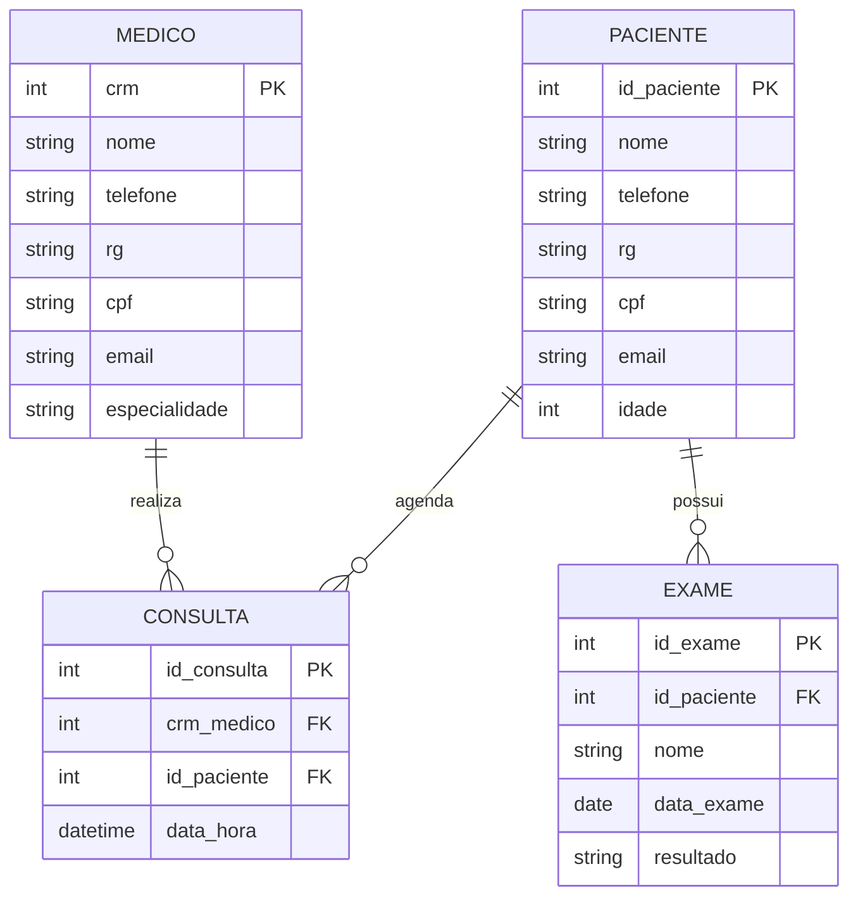

# Exercicio 01 - Consultorio medico

O modelo registra medicos, pacientes, consultas e exames. A consulta liga um paciente ao medico que realizou o atendimento.

```mermaid
erDiagram
    MEDICO ||--o{ CONSULTA : realiza
    PACIENTE ||--o{ CONSULTA : agenda
    PACIENTE ||--o{ EXAME : possui

    MEDICO {
        int crm PK
        string nome
        string telefone
        string rg
        string cpf
        string email
        string especialidade
    }
    PACIENTE {
        int id_paciente PK
        string nome
        string telefone
        string rg
        string cpf
        string email
        int idade
    }
    CONSULTA {
        int id_consulta PK
        int crm_medico FK
        int id_paciente FK
        datetime data_hora
    }
    EXAME {
        int id_exame PK
        int id_paciente FK
        string nome
        date data_exame
        string resultado
    }
```
