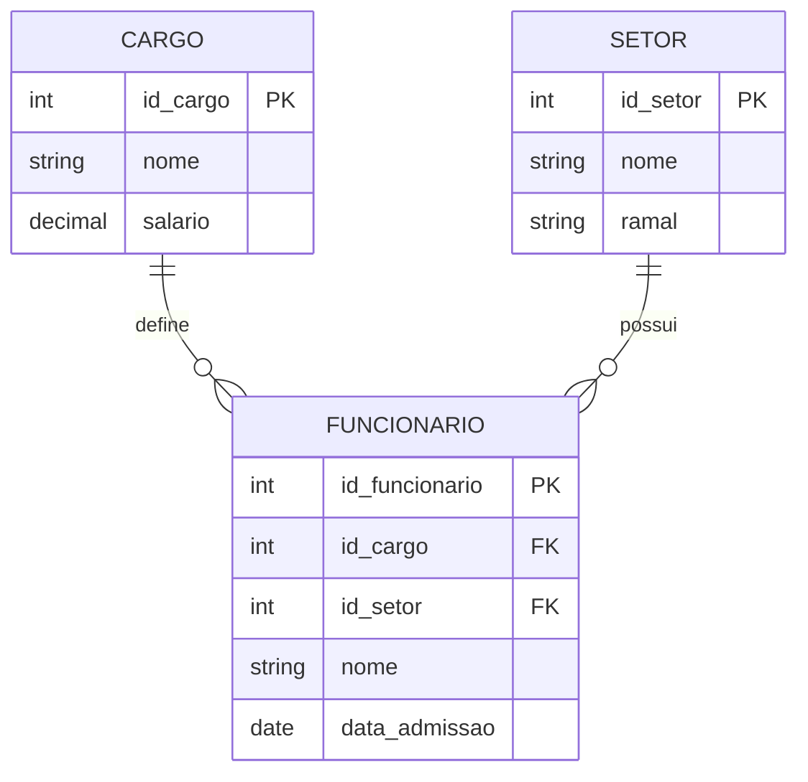

# Exercicio 02 - Controle de pessoal simplificado

O salario pertence ao cargo, pois todos os funcionarios do mesmo cargo recebem o mesmo valor. O ramal pertence ao setor, pois cada setor possui apenas um ramal.

