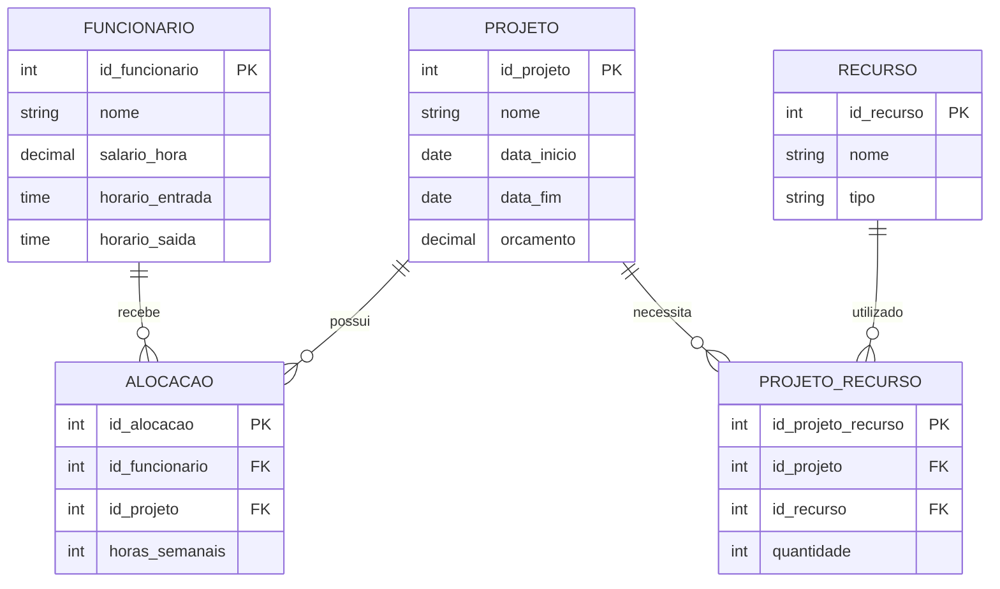

# Exercicio 03 - Controle de projetos

Um funcionario pode trabalhar em varios projetos, e um recurso pode ser utilizado por mais de um projeto. Por isso, os dois casos foram resolvidos com entidades associativas.

