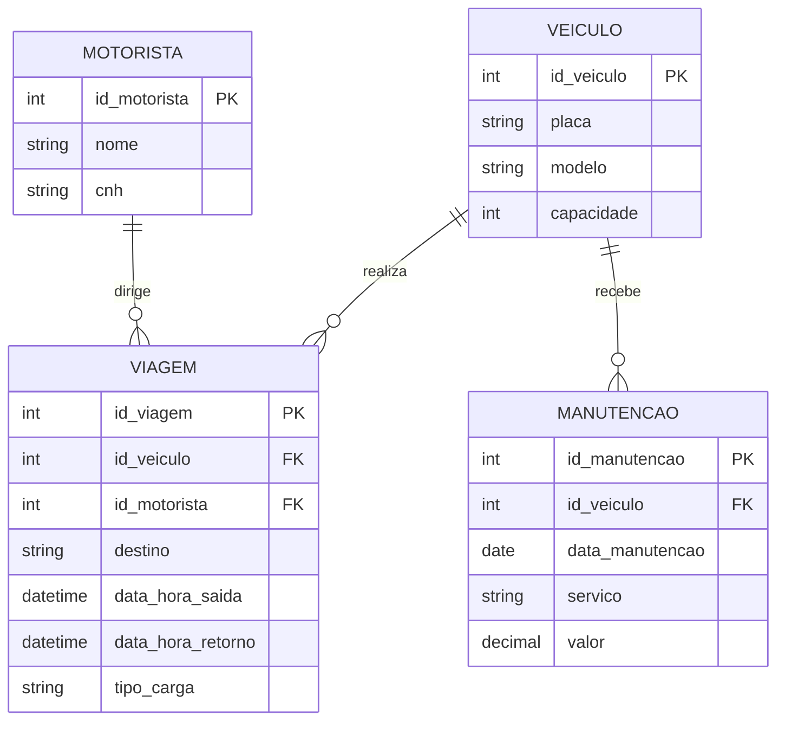

# Exercicio 04 - Controle de veiculos

Cada viagem utiliza um veiculo e possui um motorista. As manutencoes ficam ligadas ao veiculo que recebeu o servico.

```mermaid
erDiagram
    VEICULO ||--o{ VIAGEM : realiza
    MOTORISTA ||--o{ VIAGEM : dirige
    VEICULO ||--o{ MANUTENCAO : recebe

    VEICULO {
        int id_veiculo PK
        string placa
        string modelo
        int capacidade
    }
    MOTORISTA {
        int id_motorista PK
        string nome
        string cnh
    }
    VIAGEM {
        int id_viagem PK
        int id_veiculo FK
        int id_motorista FK
        string destino
        datetime data_hora_saida
        datetime data_hora_retorno
        string tipo_carga
    }
    MANUTENCAO {
        int id_manutencao PK
        int id_veiculo FK
        date data_manutencao
        string servico
        decimal valor
    }
```
