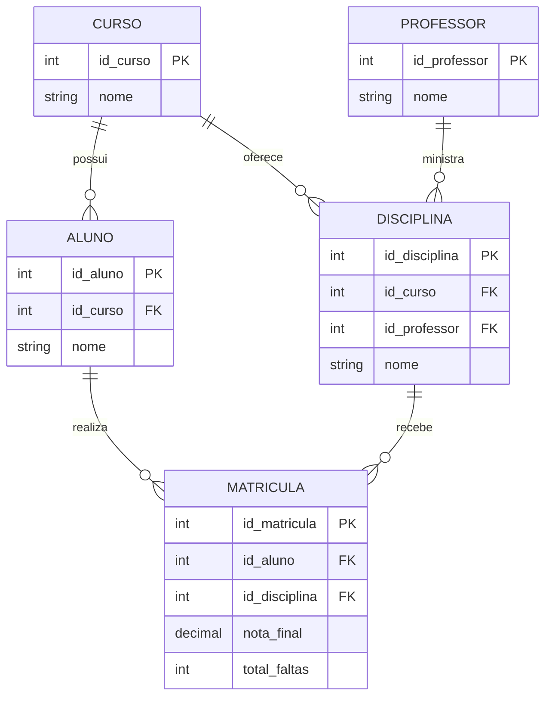

# Exercicio 05 - Controle escolar

A matricula resolve a relacao entre aluno e disciplina e guarda a nota final e o total de faltas.

```mermaid
erDiagram
    CURSO ||--o{ ALUNO : possui
    CURSO ||--o{ DISCIPLINA : oferece
    PROFESSOR ||--o{ DISCIPLINA : ministra
    ALUNO ||--o{ MATRICULA : realiza
    DISCIPLINA ||--o{ MATRICULA : recebe

    CURSO {
        int id_curso PK
        string nome
    }
    ALUNO {
        int id_aluno PK
        int id_curso FK
        string nome
    }
    PROFESSOR {
        int id_professor PK
        string nome
    }
    DISCIPLINA {
        int id_disciplina PK
        int id_curso FK
        int id_professor FK
        string nome
    }
    MATRICULA {
        int id_matricula PK
        int id_aluno FK
        int id_disciplina FK
        decimal nota_final
        int total_faltas
    }
```
