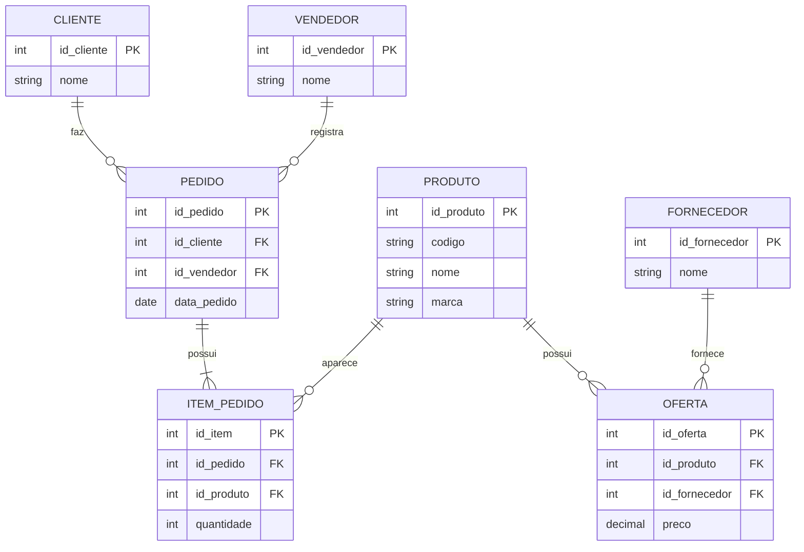

# Exercicio 06 - Controle de pedidos

O pedido pertence a um cliente e a um vendedor. Os produtos do pedido ficam em itens separados, onde a quantidade e registrada. A oferta guarda o fornecedor e o preco de cada produto.

