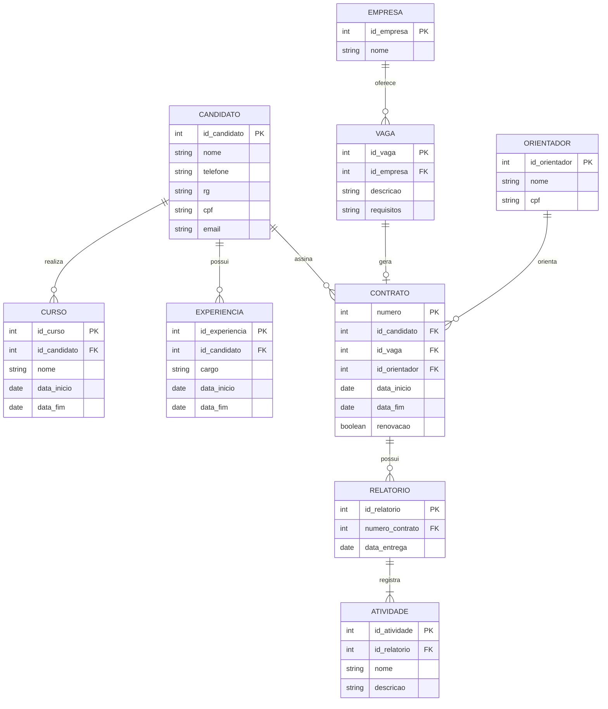

# Exercicio 07 - Controle de estagios

O candidato pode cadastrar varios cursos e experiencias. Quando uma vaga e preenchida, o contrato liga candidato, vaga e orientador. Cada contrato pode possuir relatorios com varias atividades.

