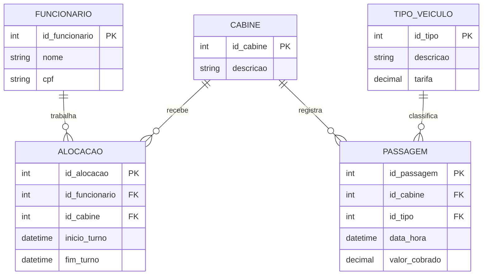

# Exercicio 08 - Sistema de pedagios

A passagem registra a cabine, o tipo de veiculo, a data e o valor cobrado. A alocacao permite saber qual funcionario estava trabalhando em cada cabine e turno.

