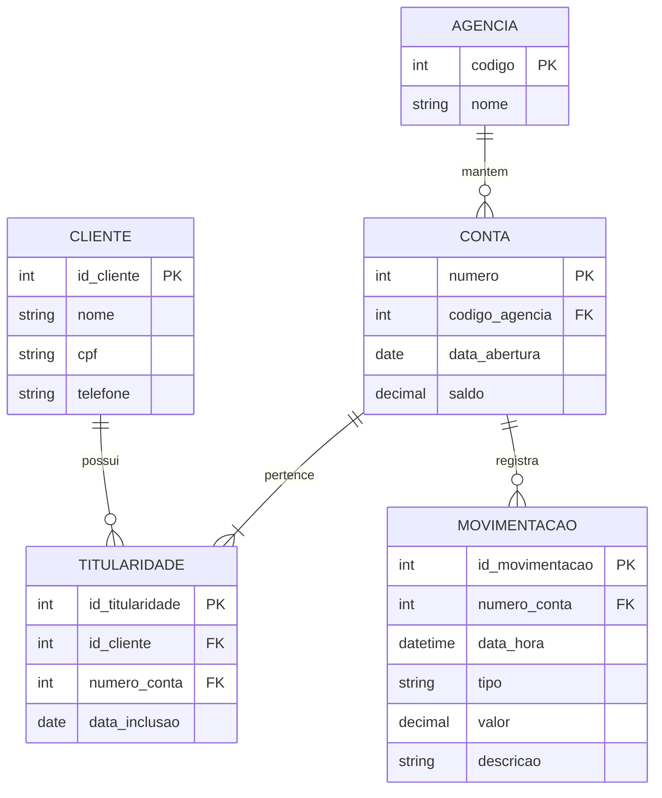

# Exercicio 09 - Sistema bancario

A titularidade permite contas conjuntas e tambem que um cliente possua contas em agencias diferentes. Os creditos e debitos ficam registrados como movimentacoes da conta.

