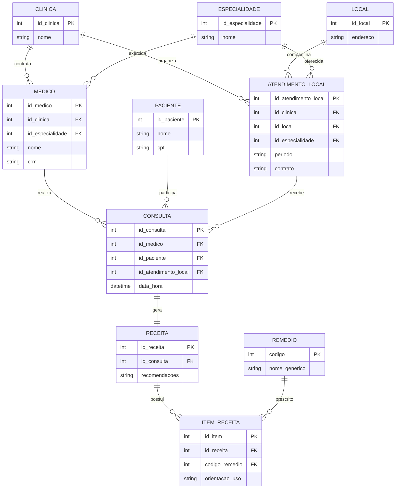

# Exercicio 10 - Clinicas medicas

O atendimento local informa qual especialidade uma clinica oferece em cada endereco. A consulta gera obrigatoriamente uma receita, que pode ter nenhum ou varios remedios.

Regra adicional: o mesmo remedio nao deve ser repetido para o mesmo paciente na mesma data.
